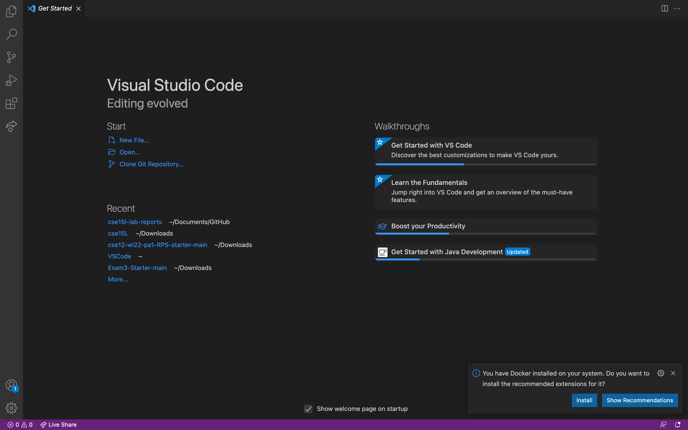

# Lab Report 1

## Week 2

This lab report will cover how to log into a course-specific account on **ieng6**.
There will be 6 steps for this tutorial

- Installing VSCode
- Remotely Connecting
- Trying Commands
- Setting an SSH Key
- Optimizing Remote Running

---

## Installing VSCode

1. Click the following link and follow all directions to set up VSCode on your device.

- Note that there are different versions; download the one compatible with your operating system
  > [Link to install VSCode](https://code.visualstudio.com/)

2. When you are finished, open VSCode and it should look something like this.
   

---

## Remotely Connecting

1. Download OpenSSH if you are on windows; otherwise, skip this step.
   > [OpenSSH](https://docs.microsoft.com/en-us/windows-server/administration/openssh/openssh_install_firstuse)
2. Look up your course specific account on
   > [UCSD accounts](https://sdacs.ucsd.edu/~icc/index.php)
3. Open up a terminal by clikcing the following button
   
4. Now type the following commands into the terminal with zz replaced with your account
   > `ssh cs15lwi22zz@ieng6.ucsd.edu`
5. The first time you try connecting, you will get a message asking about the authenticity of host. Just say yes and go on.

6. You will also be asked for your password. You should receive something like this after you are logged on to the server.

```

 Session contents restored from 1/13/2022 at 4:46:51 PM

bash: /Users/jameshan/.profile: No such file or directory

The default interactive shell is now zsh.
To update your account to use zsh, please run `chsh -s /bin/zsh`.
For more details, please visit https://support.apple.com/kb/HT208050.
Jamess-MacBook-Pro-2:cse15l-lab-reports jameshan$ ssh cs15lwi22agf@ieng6.ucsd.edu
Password:
Password:
Last failed login: Thu Jan 13 16:56:23 PST 2022 from 100.83.43.181 on ssh:notty
There was 1 failed login attempt since the last successful login.
============================ NOTICE =================================
Authorized use of this system is limited to password-authenticated
usernames which are issued to individuals and are for the sole use of
the person to whom they are issued.

Privacy notice: be aware that computer files, electronic mail and
accounts are not private in an absolute sense.  You are responsible
for adhering to the ETS Acceptable Use Policies, which you can review at:
https://blink.ucsd.edu/faculty/instruction/tech-guide/policies/ets-acceptable-use-policies.html
=====================================================================

*** Problems, Suggestions, or Feedback ***

    For help requests, please create a ticket at:
    https://support.ucsd.edu/its

    You may also report issues, suggestions, or feedback by e-mailing root on any system:
    mail -s "Your subject here" root
    Type your message - Ctrl+D to send

*** Access our Linux ssh terminals or remote desktops via a web browser at: ***
    https://linuxcloud.ucsd.edu

    All accounts must be enrolled in Duo for access. No VPN required.


-------------------------------------------------------

quota: No filesystem specified.
Hello cs15lwi22agf, you are currently logged into ieng6-201.ucsd.edu

You are using 0% CPU on this system

Cluster Status
Hostname     Time    #Users  Load  Averages
ieng6-201   16:55:01   27  2.75,  3.24,  3.20
ieng6-202   16:55:01   22  1.85,  2.27,  2.31
ieng6-203   16:55:01   19  1.39,  1.51,  1.41


Thu Jan 13, 2022  4:56pm - Prepping cs15lwi22
[cs15lwi22agf@ieng6-201]:~:24$
```

7. Keep in mind that the terminal now says you are executing from ieng6 now.

---

## Trying Commands

1. Try running some commands on the remote computer and diving into the structure and contents of the server.

- ls
- 
- pwd
- 
- exit
- 

---

## Moving Files with scp

1. You can send files from your local computer to the server using the command scp.
   The format will be like this

- `$ scp [FILETOSEND] [SERVER]:~/`

2. The `:~/` at the end of the command means the file will be moved to the home directory of the server.
3. This should be the result when scp-ing files
   
4. Then, after logging in to the remote, we can run command `ls` in order to check if the file is there.
5. As we can see, it is.
   

---

## Setting an SSH Key

1. In order to not have to authenticate everytime using ssh, we can make an ssh key.
2. the command `ssh-keygen` will generate a public and private key

- the public key will go in the server
- the private key will go in the client

3. the pair of keys enable the two machines to communicate without a password.
4. on the client, run `ssh-keygen`.
   You should get something like the following:

```
Jamess-MacBook-Pro-2:cse15l-lab-reports jameshan$ ssh-keygen
Generating public/private rsa key pair.
Enter file in which to save the key (/Users/jameshan/.ssh/id_rsa):
/Users/jameshan/.ssh/id_rsa already exists.
Overwrite (y/n)?
Jamess-MacBook-Pro-2:cse15l-lab-reports jameshan$ ssh-keygen
Generating public/private rsa key pair.
Enter file in which to save the key (/Users/jameshan/.ssh/id_rsa):
/Users/jameshan/.ssh/id_rsa already exists.
Overwrite (y/n)? y
Enter passphrase (empty for no passphrase):
Enter same passphrase again:
Your identification has been saved in /Users/jameshan/.ssh/id_rsa.
Your public key has been saved in /Users/jameshan/.ssh/id_rsa.pub.
The key fingerprint is:
SHA256:erX4ClOUx8zduhCc6fwzwq+uZ5tL+H29pP8nBO+lIgU jameshan@Jamess-MacBook-Pro-2.local
The key's randomart image is:
+---[RSA 3072]----+
|                 |
|         * + .   |
|        o X . .  |
|       . +E...   |
|        S =..o   |
|       o = +..o .|
|      + + =.=o = |
|       + ++=.oB o|
|        o*O=o+.+=|
+----[SHA256]-----+
```

5. [If on windows, follow these additional steps](https://docs.microsoft.com/en-us/windows-server/administration/openssh/openssh_keymanagement#user-key-generation)
6. Copy the public key onto the server
7. Log on to the server and make a directory called .ssh using the command `mkdir .ssh`
8. SCP the public key into the .ssh directory you just made.

```
Jamess-MacBook-Pro-2:cse15l-lab-reports jameshan$ scp /Users/hamesjan/.ssh/id_rsa.pub cs15lwi22agf@ieng6.ucsd.edu:~/.ssh/authorized_keys
```

9. After your key has been moved, you should get a message like this.
   
10. Now you should be able to scp or ssh from this client to the server without being asked for a password

---

## Optimizing Remote Running

1. There are additional steps you can take to make remote running more efficient.

- You can type a command to run on the server and immediately exit afterwards by enclosing a command in quotation marks after ssh and the addresss.

```
Jamess-MacBook-Pro-2:cse15l-lab-reports jameshan$ ssh cs15lwi22agf@ieng6.ucsd.edu "ls"
Hello.java
perl5
step3pic.png
WhereAmI.class
WhereAmI.java
```

- You can use tab to automatically finish long filenames
- You can press the up arrow on the terminal to bring up past commands
- You can execute multiple commands in order by using semicolons.
  

---
