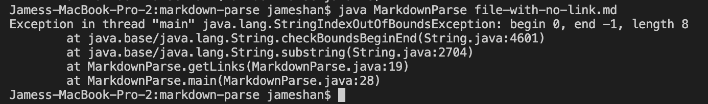

# Lab Report 2

## Week 4

**Bug 1**

# Code Change

# Test File for Failure-Inducing-Input

- [file-with-no-link.md](lr2-images/file-with-no-link.md)
- [file-with-char-at-end.md](lr2-images/file-with-char-at-end.md)

# Symptom of Failure-Inducing Input

Both of the test files above were fixed by the code change which broke the while loop if no parenthesis or brackets were found. Both failure-inducing inputs had squirlly formatting and the parenthesis were not in order. The symptoms indicated that something funky was going on with the indexing of the special characters; therefore I knew that I needed to check edge cases for when the format of special characters would be unconventional.

**Bug 2**

# Code Change

# Test File for Failure-Inducing-Input

- [file-with-space.md](lr2-images/file-with-space.md)

# Symptom of Failure-Inducing Input

The bug was found when trying to test a file with characters between the ] and ( characters in a file. The failure-inducing input was the file with spaces between the characters and the symptom was a Java Out of Memory error, which indicates that the relationship between efficency of space usage and garbage collection was unbalanced.

**Bug 3**

# Code Change

# Test File for Failure-Inducing-Input

- There is no test file for the failure-inducing-input for this bug because the failure-inducing-input is no input at all.

# Symptom of Failure-Inducing Input

The symptom indicates that there is a Java IndexOutOfBoundsError in the main thread. The bug can be attributed to the fact that there is no input when trying to run MarkdownParse.java with no input; the code change allows us to catch that edge case and print out a message if incorrect input is given.
