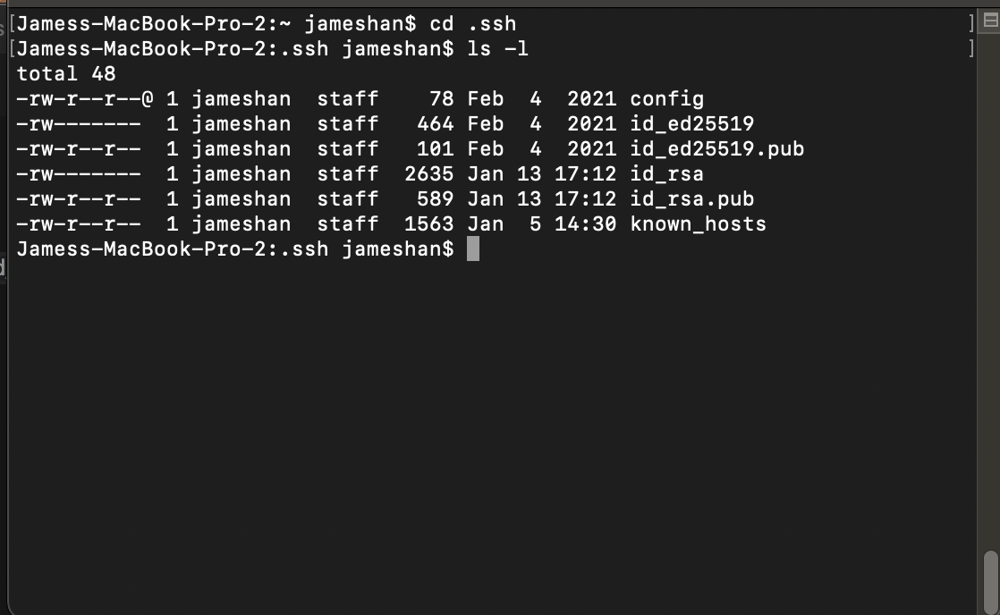
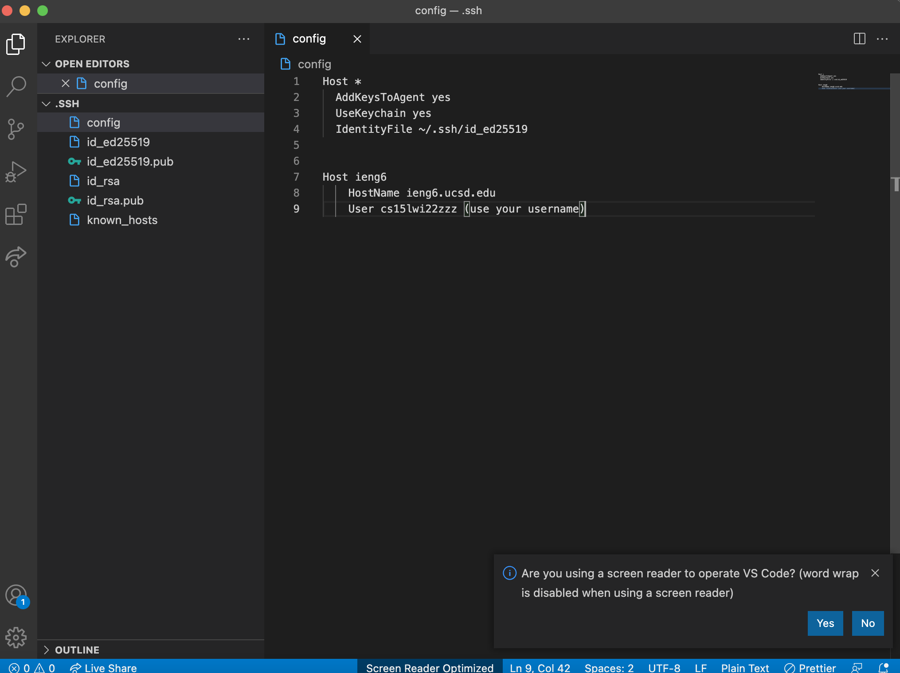
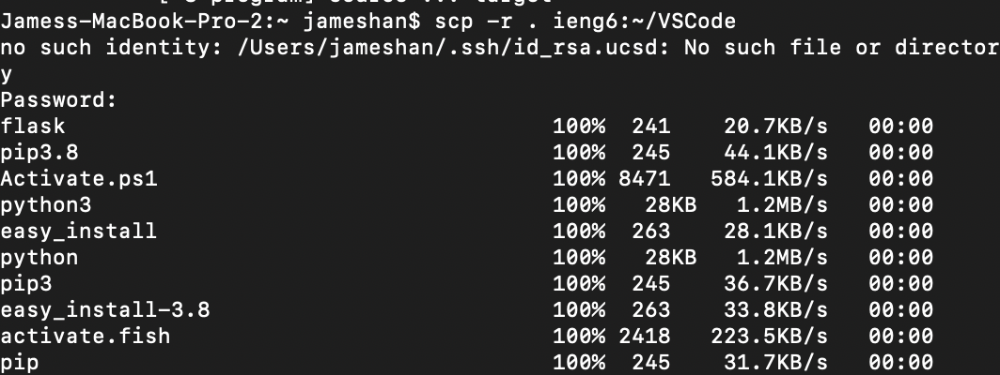
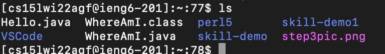

# Lab Report 3

## Week 6

# How to Streamline ssh Configuration

1. First, go into your .ssh folder and edit the config file.
   Since the folder starts with a ., it will be hidden.
   A good way to access it is through the terminal!
   

2. Second, edit the config file, adding another Host, the alias name, and the Hostname and User.
   Setting up these configurations will allow you to shortcut your way into ieng6, or any server.
   

3. You can do other cool things, like scp using the alias!
   

> If you log into ieng6 and do ls -l, you can see that the folder has been copied using the alias

> That's all on how to streamline ssh configuration. Try utilizing the alias when logging in as it saves so much more time!
