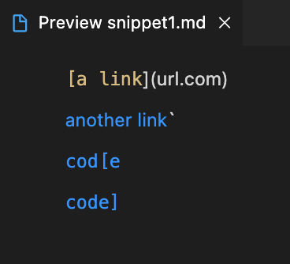
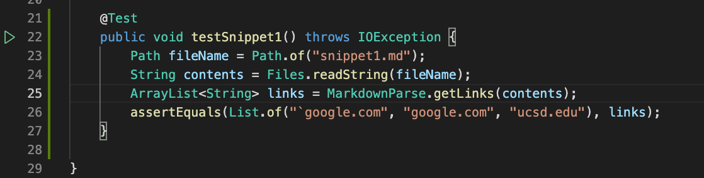
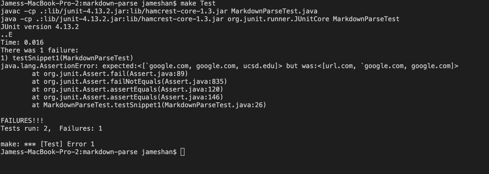
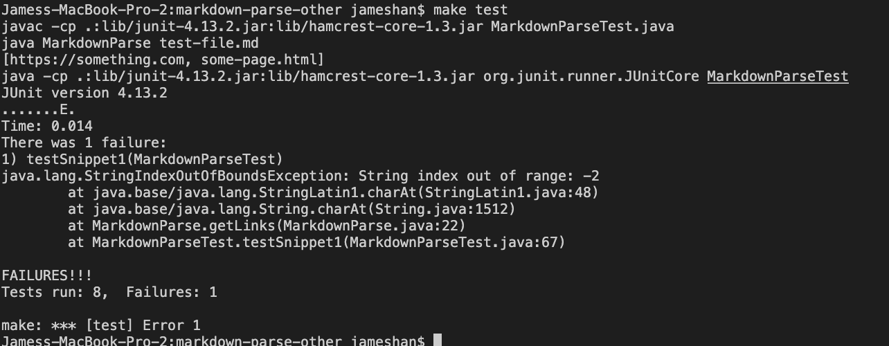
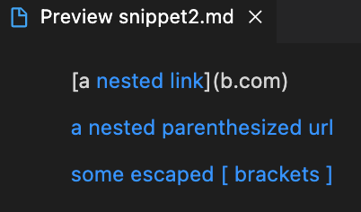
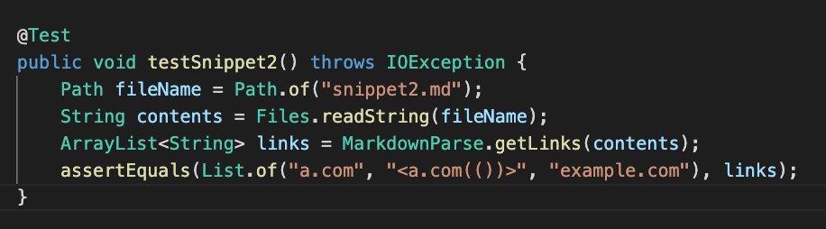
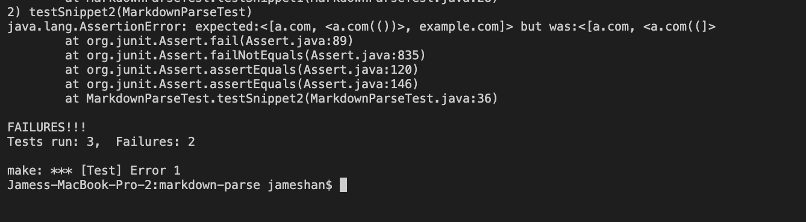
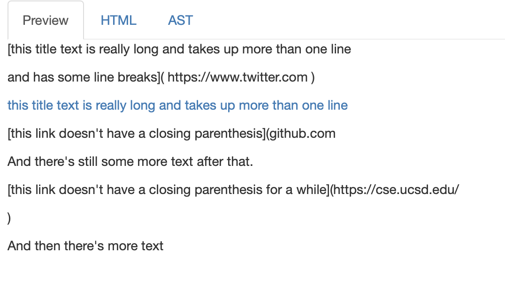
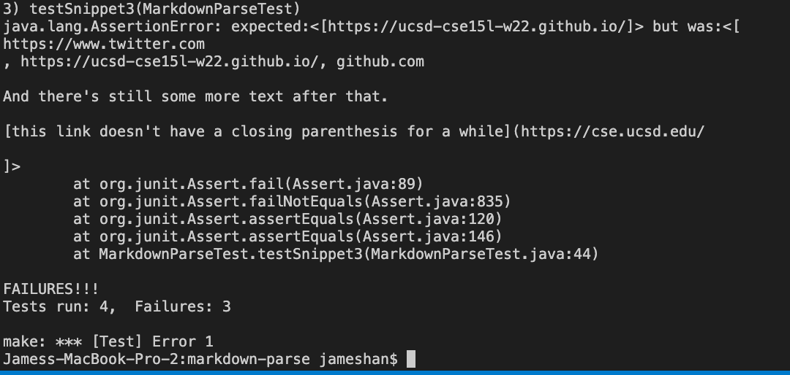
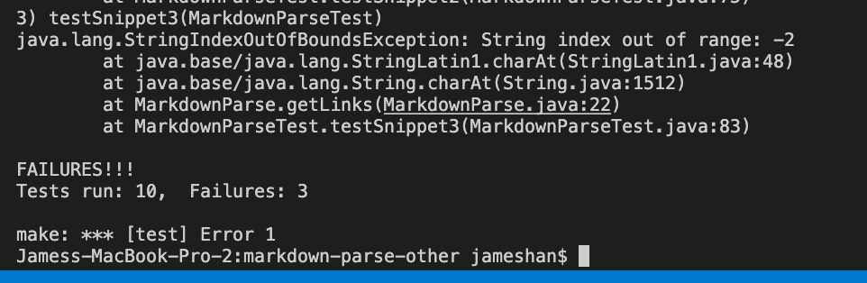

## Lab Report 4

# Week 8

- Kathy's MarkdownParse
- [link to other repo](https://github.com/kathyychenn/markdown-parse)

- My MarkdownParse
- [link to my repo](https://github.com/hamesjan/markdown-parse)

## Snippet 1

### Test 1 (My implementation)

snippet1.md should produce the following output, as seen in VSCode preview

```
["`google.com", "google.com". "ucsd.edu"]
```



I turned it into a test by checking whether the links outputted from the file would be the links showing up in blue on the expected image.


My test failed.


### Test 2 (Their Implementation)

snippet1.md should produce the following output, as seen in VSCode preview

```
["`google.com", "google.com". "ucsd.edu"]
```


I turned it into a test by checking whether the links outputted from the file would be the links showing up in blue on the expected image.


Their test failed.


## Snippet 2

### Test 3 (My Implementation)

snippet2.md should produce the following output, as seen in VSCode preview

```
["a.com", "<a.com(())>". "example.com"]
```



I turned it into a test by testing whether the links attached to the blue text in the VSCode preview is in the list returned.


My test failed.


### Test 4 (Their Implementation)

snippet2.md should produce the following output, as seen in VSCode preview

```
["a.com", "<a.com(())>". "example.com"]
```


I turned it into a test by testing whether the links attached to the blue text in the VSCode preview is in the list returned.


Their test passed.

## Snippet 3

### Test 5 (My Implementation)

snippet3.md should produce the following output, as seen in Common Mark

```
["https://ucsd-cse15l-w22.github.io/"]
```

The link attached to the blue text is the one above.



I turned it into a test by testing whether the links attached to the blue text in CommonMark is in the list returned my the method.


My test failed.


### Test 6 (Their Implementation)

snippet3.md should produce the following output, as seen in Common Mark

```
["https://ucsd-cse15l-w22.github.io/"]
```

The link attached to the blue text is the one above.


I turned it into a test by testing whether the links attached to the blue text in CommonMark is in the list returned my the method.


Their test failed.


> Do you think there is a small (<10 lines) code change that will make your program work for snippet 1 and all related cases that use inline code with backticks? If yes, describe the code change. If not, describe why it would be a more involved change.

I do not think there is a small code change. The change required would be to check if the open parenthesis is between tick marks and if there are, then continue after the closing tick mark. Also, we need to check that the open bracket is not between tick marks between the parenthesis, as seen in the last link in snippet1.md

> Do you think there is a small (<10 lines) code change that will make your program work for snippet 2 and all related cases that nest parentheses, brackets, and escaped brackets? If yes, describe the code change. If not, describe why it would be a more involved change.

I do not think there is a small code change; it would be too involved. To fix this, I would change the code when searching for end parenthesis wait till the end of a > if they see a < in the link. This can be achieved by putting an if statement checking whether there is a < character, and then putting an && clause in the if statement searching for the end parenthesis to check whether the index of the close parenthsis is after the > character.

> Do you think there is a small (<10 lines) code change that will make your program work for snippet 3 and all related cases that have newlines in brackets and parentheses? If yes, describe the code change. If not, describe why it would be a more involved change.

Yes I think thhere is a small change I can make to make my program work for snippet 3. This change would be to check whether the link is stripped of whitespace. This would be achieved through checking when finding the open and close parenthesis that there are no spaces between them.
