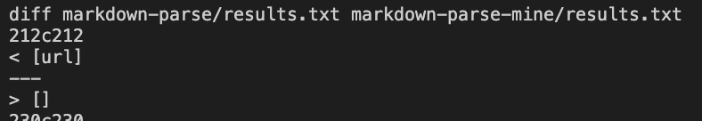
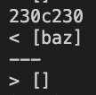

# Lab Report 5

## Week 10

How I found different tests:

To find test files that produce different results, I basically created a script.sh that echos the file name and the results when using the test with the code and put the results into a file called results.txt for both implementations


Then, I look at the diff results and compare lines of the files that are different

## Test 1: test-files/194.md



---

## Test 2: test-files/201.md



> Implementation Analysis

# Test 1

My implementation is correct for this test, while their implmentation is wrong. For their implmenetation,
Actual output:

```
[url]
```

Expected output:

```
[]
```

The bug in their implmentation is that they do not check if the open parenthesis is right after the close bracket. We can fix this by adding an if check before adding to toReturn

```
 if (nextCloseBracket + 1 == openParen) {
                if (openParen + 1 != closeParen) {
                    toReturn.add(markdown.substring(openParen + 1, closeParen));
                }
            }

```

# Test 2

My implmentation is correct for this test, while their implmentation is wrong.
Actual output:

```
[baz]
```

Expected:

```
[]
```

The bug in this code is exactly similar to the one described above. By adding an if check right before adding to the toReturn that checks whether the position of the open parenthesis is right after the close bracket, we can be sure to only add links that have the correct syntax.

```
 if (nextCloseBracket + 1 == openParen) {
                // add to to return
            }

```
