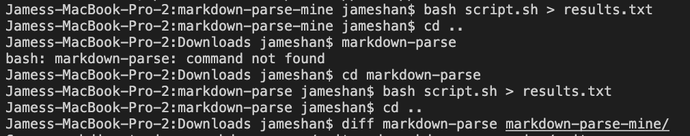
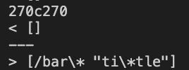

# Lab Report 5

## Week 10

How I found different tests:

To find test files that produce different results, I basically created a script.sh that echos the file name and the results when using the test with the code and put the results into a file called results.txt for both implementations


Then, I look at the diff results and compare lines of the files that are different

## Test 1: test-files/194.md


---

## Test 2: test-files/201.md



> Implementation Analysis

# Test 1

My implementation is correct for this test, while their implmentation is wrong. For their implmenetation,
Actual output:

```
My implementation: []
Their implmenetation: [url]
```

Expected output:

```
[]
```

The bug in their implmentation is that they do not check if the open parenthesis is right after the close bracket. We can fix this by adding an if check before adding to toReturn

```
 if (nextCloseBracket + 1 == openParen) {
                if (openParen + 1 != closeParen) {
                    toReturn.add(markdown.substring(openParen + 1, closeParen));
                }
            }

```

# Test 2

My implmentation is incorrect for this test, while their implmentation is correct. We know this because in the test file, we need the link between the parenthesis, which also can not contain any whitespace within the link.
Actual output:

```
My implementation: [/bar\* "ti\*tle"]
Their implmentation: []
```

Expected:

```
[]
```

The bug in this code is that we are not checking whether the text within the parenthesis is stripped of whitespace. We can fix this simply by adding an if check before adding to return that checks if whether the link stripped is equal to the link itself.


